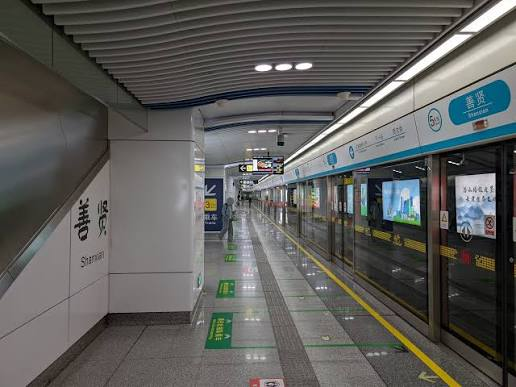
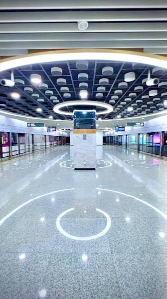

# Metro redesign — reference brief

Status: requested scope captured; design decisions pending. Business-income deployment remains deferred. These references are user-supplied design inspiration, not runtime game textures.

## Requested experience
- Replace the outside ticket-selling NPC with a rechargeable transit card inspired by Hong Kong's Octopus card.
- Charge different fares according to journey distance.
- Rebuild the underground station interior using the supplied platform references, retaining the game's cute low-poly style.
- Trains visibly arrive and depart. Players physically walk into a stopped train rather than board automatically.
- After boarding, support a ride experience and a fade/skip option; exact default to settle in design.
- Arrive at a grand Yunhai central station with several lines, a large concourse and clear wayfinding.
- Keep routes, fares and station content modular for later expansion.

## Saved original references

These images guide underground platforms. Yunhai's central station additionally requires a much larger multi-line central hall; the images do not depict its full proposed layout.

## Proposed decisions to review
- Use a free transit card with coin-funded top-ups, displayed fares and balance before travel.
- Support entry/exit validation without trapping a player who lacks funds; preserve value from existing tickets/passes through an explicit migration.
- Prefer a short scenic ride with optional skip; skipping changes presentation only, never fare or destination.
- Decide whether several Yunhai lines are operational immediately or whether unopened lines are marked as future expansion.
- Keep beginner travel instructions understandable in English with Mandarin labels and optional language practice.

## Acceptance areas
Fare calculation and single charging; old-save compatibility; boarding only through open doors; safe departure and arrival; skip/reload recovery; collision and route accessibility; clear signage; browser performance.

Confirmed scope: only Qinghe–Yunhai operates initially. Other lines have clearly marked placeholder spaces for later iteration. Proposed design: ../specs/2026-09-30-metro-redesign-design.md
